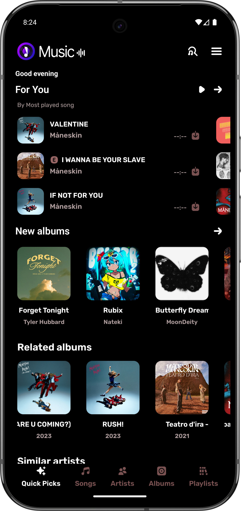
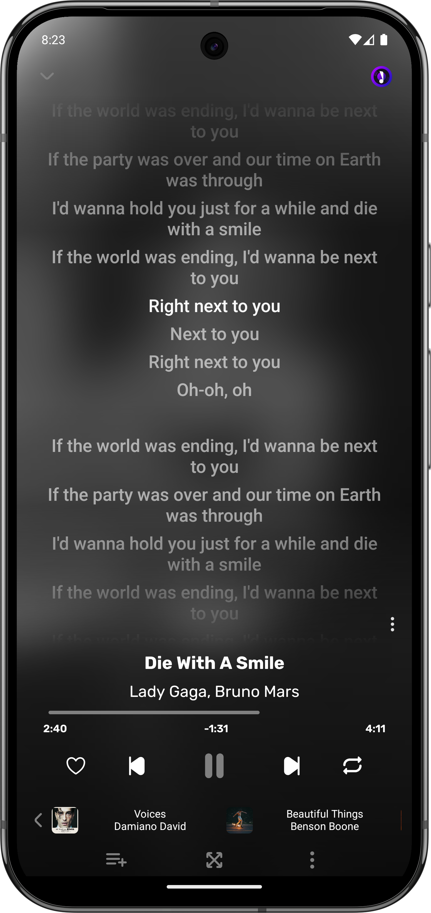
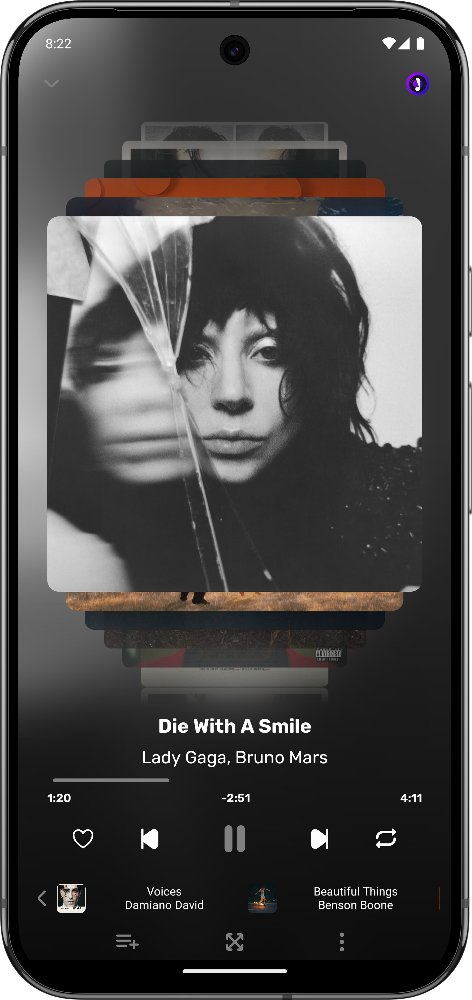
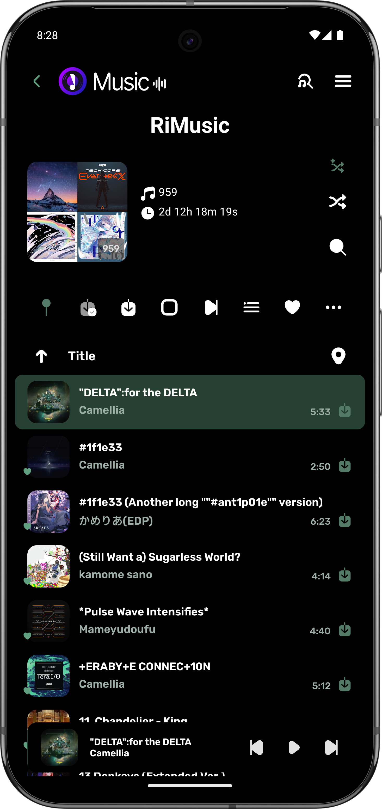
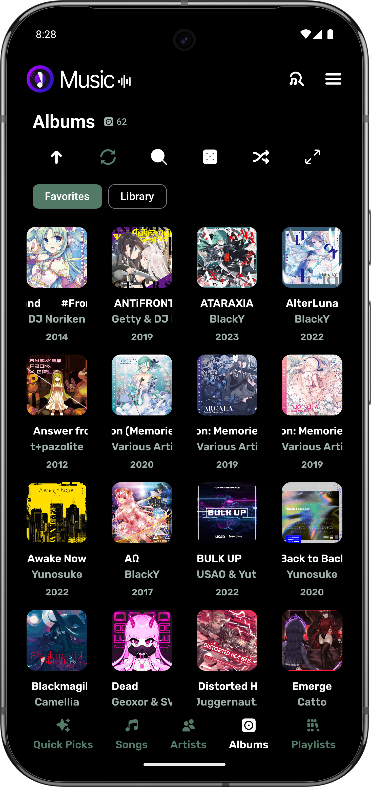
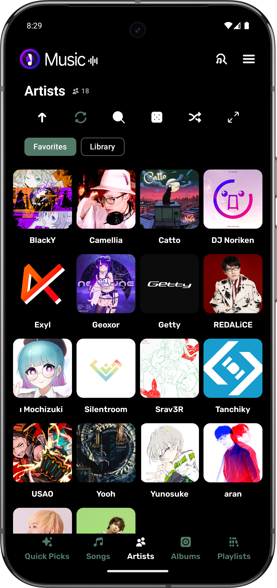
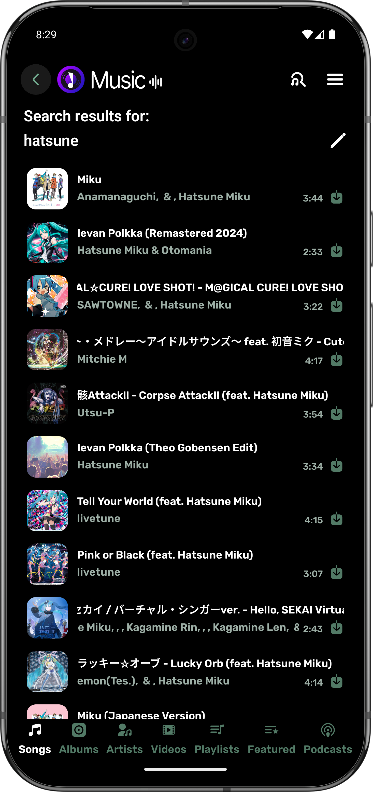
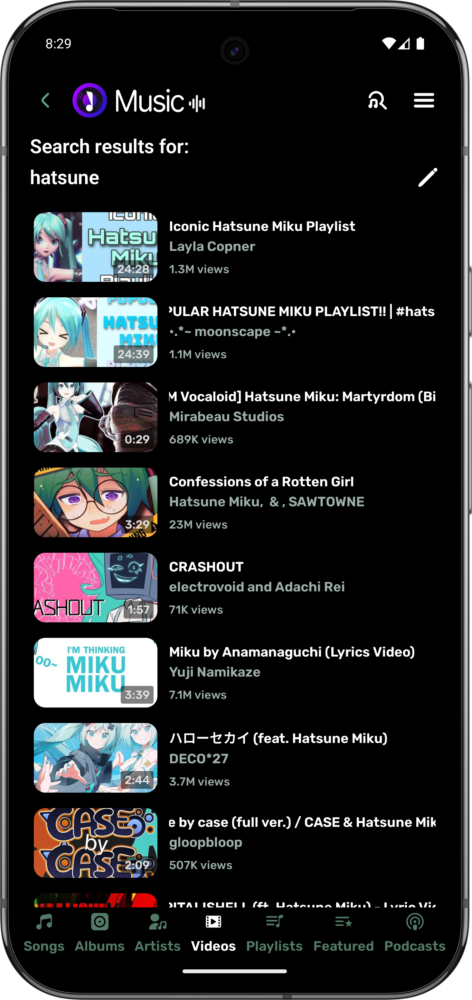
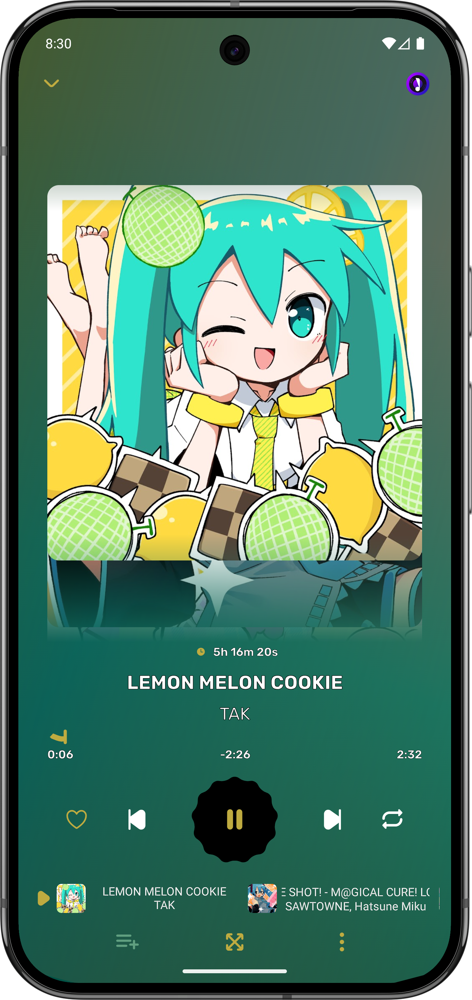
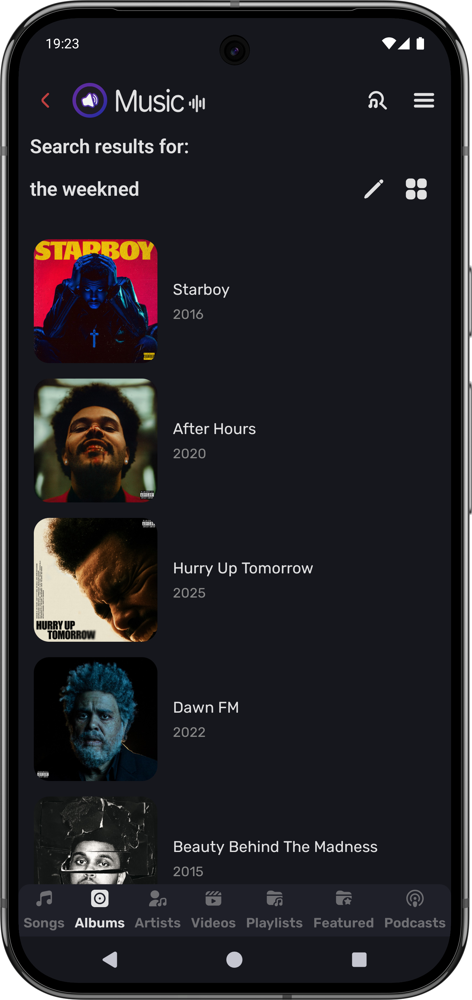

<p align="center">
  
</p>

<h1 align="center">Cubic Music</h1>

<p align="center">
  <strong>An expressive, open-source music experience for Android.</strong>
  <br />
  Stream from YouTube Music, build your library, download for offline listening, follow word-timed lyrics, and make the player your own.
</p>

<p align="center">
  <a href="https://github.com/cybruGhost/Cubic-Music/releases/latest/download/Cubic-Music-full.apk">
    
  </a>
  <a href="https://github.com/cybruGhost/Cubic-Music/releases">
    
  </a>
</p>

<p align="center">
  <a href="https://github.com/cybruGhost/Cubic-Music/releases/latest"></a>
  <a href="https://github.com/cybruGhost/Cubic-Music/releases"></a>
  
  <a href="./LICENSE"></a>
  <a href="https://crowdin.com/project/cubic-music"></a>
</p>

> [!NOTE]
> Cubic Music is under active development. YouTube may occasionally change upstream playback behavior; install the newest release before reporting a playback problem.

<p align="center">
  <a href="#overview">Overview</a> |
  <a href="#features">Features</a> |
  <a href="#installation">Installation</a> |
  <a href="#playlist-import-and-export">Playlists</a> |
  <a href="#build-from-source">Build</a> |
  <a href="#contributing">Contribute</a>
</p>

## Overview

Cubic Music is a free and open-source YouTube Music frontend and offline music player for Android. It combines online discovery, a persistent local library, flexible downloads, synchronized lyrics, deep visual customization, and living-room or car playback in one app.

No Cubic Music subscription is required. Listening statistics and Rewind insights are generated from your own library history, while account-based integrations remain optional.

<p align="center">
  
  
  
  
  
</p>

<details>
  <summary><strong>View more screenshots</strong></summary>
  <br />
  <p align="center">
    
    
    
    
    
  </p>
</details>

## Why Cubic Music

| | |
|---|---|
| **Online and offline** | Stream music, cache while listening, or download songs and playlists for reliable offline playback. |
| **Lyrics that move with the music** | Use synchronized, unsynchronized, translated, and word-timed karaoke lyrics with provider selection and editing tools. |
| **A player that feels personal** | Choose dynamic themes, multiple player surfaces, visualizers, artwork-driven notification colors, and Canvas-style visuals. |
| **Your listening story** | View exact play counts, complete listening history, streaks, top tracks, artists, and shareable Cubic Rewind cards. |
| **Built for Android** | Background playback, media notifications, widgets, sleep timer, Android Auto, Android TV, and headset controls. |
| **Open by design** | GPL-3.0 source code, community translations, local library tools, and no app subscription or hidden feature paywall. |

## Features

### Playback and audio

- YouTube Music streaming with automatic source recovery
- Background and lock-screen playback
- Reusable service-owned crossfade with configurable duration
- Gapless playback when crossfade is disabled or unavailable
- Playback speed, pitch, volume normalization, and silence skipping
- Multiple audio visualizers and player layouts
- Sleep timer and queue controls
- Optional video playback

### Offline library

- Song and playlist downloads
- Configurable playback cache
- Downloaded, cached, and corrupt-file views with integrity checks
- Offline playback and local-song support
- Library, database, settings, and playlist export tools
- Custom playlist artwork that persists across restarts

### Lyrics and discovery

- Synchronized and unsynchronized lyrics
- Word-by-word karaoke timing where available
- Lyrics translation, romanization, editing, and provider selection
- Personalized For You recommendations and quick picks
- Search suggestions, artist and album pages, and song radio
- Cubic Rewind listening recap with real play-history data

### Personalization and integrations

- Material You and artwork-derived color palettes
- Standard, Liquid, and alternative player surfaces
- Cubic Canvas and Spotify Canvas support where available
- Custom notification colors, including a high-contrast e-ink mode
- YouTube Music account and playlist synchronization
- Spotify and Exportify CSV playlist import
- Optional Discord Rich Presence
- Android Auto, Android TV, and homescreen widgets

## Installation

### Requirements

- Android 6.0 (API 23) or newer
- An internet connection for streaming and online metadata
- Storage space for downloads and cache

### Install the APK

1. Download the latest official APK from [GitHub Releases](https://github.com/cybruGhost/Cubic-Music/releases/latest).
2. Open `Cubic-Music-full.apk` on your Android device.
3. If Android asks, allow your browser or file manager to install unknown apps.
4. Complete the installation and open Cubic Music.

> [!IMPORTANT]
> Download Cubic Music only from this repository's release page. Builds redistributed by third parties may be outdated or modified.

## Playlist import and export

Cubic Music recognizes several CSV layouts and can resolve Spotify-style rows to playable YouTube Music results.

| Format | Required identifying columns | Handling |
|---|---|---|
| Cubic/native | `PlaylistName`, `MediaId`, `Title`, `Artists`, `Duration` | Imported directly |
| Extended native | Native columns plus album, artwork, and artist IDs | Imported directly |
| Spotify export | `Track Name`, `Artist Name(s)` | Matched during import |
| Exportify | `Track URI`, `Track Name`, `Artist Name(s)`, `Album Name` | Matched during import |

<details>
  <summary><strong>Native CSV example</strong></summary>

```csv
PlaylistBrowseId,PlaylistName,MediaId,Title,Artists,Duration,ThumbnailUrl
,Favorites,1pEe7-tWv2M,Good Grief,Jenna Raine,160,https://i.ytimg.com/vi/1pEe7-tWv2M/hqdefault.jpg
```

</details>

## Build from source

### Prerequisites

- Git
- JDK 21
- Android SDK with the project compile SDK installed

```bash
git clone https://github.com/cybruGhost/Cubic-Music.git
cd Cubic-Music
./gradlew assembleFull
```

On Windows:

```powershell
.\gradlew.bat assembleFull
```

The APK is generated at:

```text
composeApp/build/outputs/apk/full/Cubic-Music-full.apk
```

Local API keys and private endpoints belong in `local.properties`; do not commit them.

## Contributing

Contributions that improve reliability, accessibility, translations, documentation, and the Android experience are welcome.

1. Search [existing issues](https://github.com/cybruGhost/Cubic-Music/issues) before opening a new one.
2. For bugs, include the Cubic Music version, Android version, device model, reproduction steps, and a short sanitized log excerpt when relevant.
3. Discuss large behavior or architecture changes before starting implementation.
4. Keep pull requests focused and avoid unrelated formatting or refactoring.
5. Run `./gradlew assembleFull` before submitting Android changes.

Never publish account cookies, OAuth tokens, API keys, or complete logs containing personal information.

## Translation

Help make Cubic Music feel native in more languages through the community translation project:

<p align="center">
  <a href="https://crowdin.com/project/cubic-music">
    
  </a>
</p>

## Support the project

Stars, bug reports, translations, code contributions, and donations all help Cubic Music improve.

<p align="center">
  <a href="https://cyberghost-shop.fourthwall.com/">
    
  </a>
  <a href="https://github.com/cybruGhost/Cubic-Music/issues/new">
    
  </a>
</p>

## Privacy

See the project [Privacy Policy](./privacy.md) and [Terms](./terms.md). Optional account integrations are controlled from the app's settings and can be disabled.

## Credits

Cubic Music is maintained by [cybruGhost](https://github.com/cybruGhost) and shaped by its users, translators, testers, and contributors. The project builds on [Kreate](https://github.com/knighthat/Kreate) and other open-source components whose licenses and notices remain with their respective projects.

## License

Cubic Music is licensed under the [GNU General Public License v3.0](./LICENSE). You may use, study, modify, and redistribute the software under the terms of that license.

## Legal notice

Cubic Music is an independent project and is not affiliated with, endorsed by, or sponsored by YouTube, Google, Spotify, Discord, or their respective partners. Product names and trademarks belong to their owners. Cubic Music does not host media; availability depends on upstream services, network conditions, account access, and region. Use the app only for content you are authorized to access or download.

---

<p align="center">
  Built for people who want their music library to feel like their own.
  <br />
  <a href="https://github.com/cybruGhost/Cubic-Music">Cubic Music</a> | <a href="https://github.com/cybruGhost/Cubic-Music/releases">Releases</a> | <a href="https://github.com/cybruGhost/Cubic-Music/issues">Issues</a>
</p>
